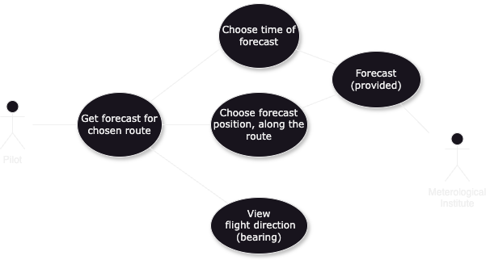
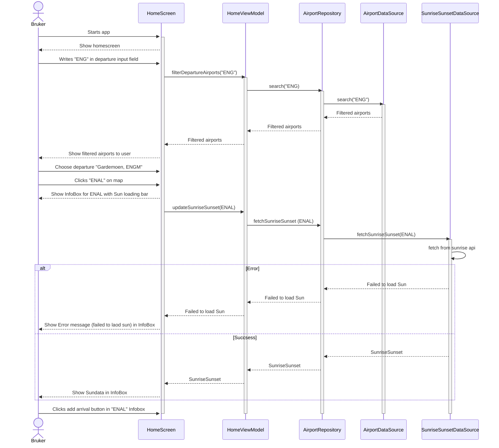

# Use Case Diagram: Fastest Route

*Plan a flight aiming to find the fastest route according to winds aloft forecast at a certain
time.*



## Textual description

### Actors

- Pilot of a small plane (the user)
- Norwegian Meteorological Institute (the API-provider)

### Main Flow

Pre-conditions:

- Pilot has chosen departure and arrival airports
- Pilot has generated brief and chosen the overall tab

Post-conditions:

- User has been presented to relevant winds aloft forecasts in order to plan the fastest flight
  route

Main Flow:

1. User chooses «Winds Aloft»
2. App displays flight direction (bearing) as a number and an icon pointing in the same direction
3. App also displays winds aloft forecast, provided by the Norwegian Meteorological Institute, for
   different heights halfway along the route. Direction of wind shows both as degrees and arrows,
   making it easily comparable to flight direction (see above).
4. User chooses another time stamp, according to time of planned flight, and pushes the Update
   button
5. App displays winds aloft forecast for new time, at same position as above
6. User chooses another point along the route by using the slider and pushing Update
7. App displays winds aloft forecast for new position, at same time as above
8. The last two steps will likely be repeated a couple of times for other points along the route
9. The user (the pilot) now has been presented forecast data from muliple points along the route,
   and will be able to consider approximately which height might be suitable for the fastest route
   at the planned flight time

Alternative Flow:

3. App displays error message if fetching forecast failed
4. User closes the Winds Aloft section
5. User opens the Winds Aloft section again (a bit later)
6. If this time fetching forecast succeeded, flow continues at main flow step 2

# Sekvensdiagram: Valg av departure/arrival



**Tekstlig beskrivelse**\
**Navn:** Valg av departure og arrival airport\
**Aktør:** Småflypilot\
**Prebetingelser:** Ingen prebetingelser\
**Postbetingelser:** Departure og arrival flyplass er valgt. Appen er klar til å opprette\
flightbrief

## Hovedflyt:

1. User starts app
2. Appen viser HomeScreen
3. Piloten skrive inn "ENG" i departure input feltet
4. filterDepartureAirports funksjon blir kalt med "ENG" argument
5. search("ENG") i airportRepository blir kalt
6. search funksjonen i AirportDataSource blir kalt og returnerer flyplasser filtrert på "ENG"
7. de filtrerte flyplassene returneres fra AirportRepository til HomeViewModel
8. searchResults i homeViewModel UiState oppdateres til de filtrerte flyplassene
9. De filtrerte flyplassene vises til bruker
10. Bruker velger "Oslo lufthavn, Gardemoen" som departure flyplass
11. Bruker trykker på "ENAL" i kartet
12. HomeScreen viser InfoBox Composable for Ålesund flyplass, ENAL. Med loading bar for soldata
13. HomeScreen kaller på updateSunriseSunset(ENAL) i AirportRepository
14. updateSunriseSunset kaller videre på fetchSunriseSunset i SunriseSunsetDataSource
15. fetchSunriseSunset henter data fra Sunrise api`et til MET og returnerer en SunriseSunset instans
16. SunriseSunset returneres til AirportRepository
17. AirportRepository returnerer SunriseSunset for ENAL til HomeViewModel
18. HomeViewModel oppdaterer sun i UiState
19. HomeScreen viser soldata for Ålesund, ENAL
20. Bruker trykker på add arrival knappen i InfoBoxen

## Alternativ flyt:

15.1. fetchSunriseSunet klarer ikke å hente data fra api, returnerer error melding til
airportRepository\
15.2. Feilmelding blir returnert til HomeViewModel. state sin sun blir satt til Error\
15.3. Feilmelding vises til bruker i InfoBox\

# Aktivitetsdiagram metar/taf

```mermaid
    flowchart TD;
        style start fill:#000,stroke:#fff,stroke-width:2px;
        style B fill:#228B22;
        style C fill:#1a8a99;
        style D fill:#1a8a99;
        style E fill:#228B22;
        style F fill:#1a8a99;
        style G fill:#ff7f0e;
        style H fill:#228B22;
        style I fill:#228B22;
        style J fill:#1a8a99;
        style K fill:#228B22,stroke:#228B22,stroke-width:2px;
        style stop fill:#000,stroke:#fff,stroke-width:2px;
        
        start((Start))
        start --> B(Homescreen)
        B --> C[/User chooses Departure/]
        C --> D[/User presses Go to brief/]
        D --> E(Flightbriefscreen #departuretab)
        E --> F[/Open metar/taf collapsible/]
        F --> G{airport has metar/taf?}
        G -->|no| H(Show nearby airports with metar/taf)
        H --> J[/User selects new airport/]
        J --> K(Metar/taf for selected airport)
        G -->|yes| I(Show Metar/Taf)
        K --> stop((End))
        I --> stop 
 ```

