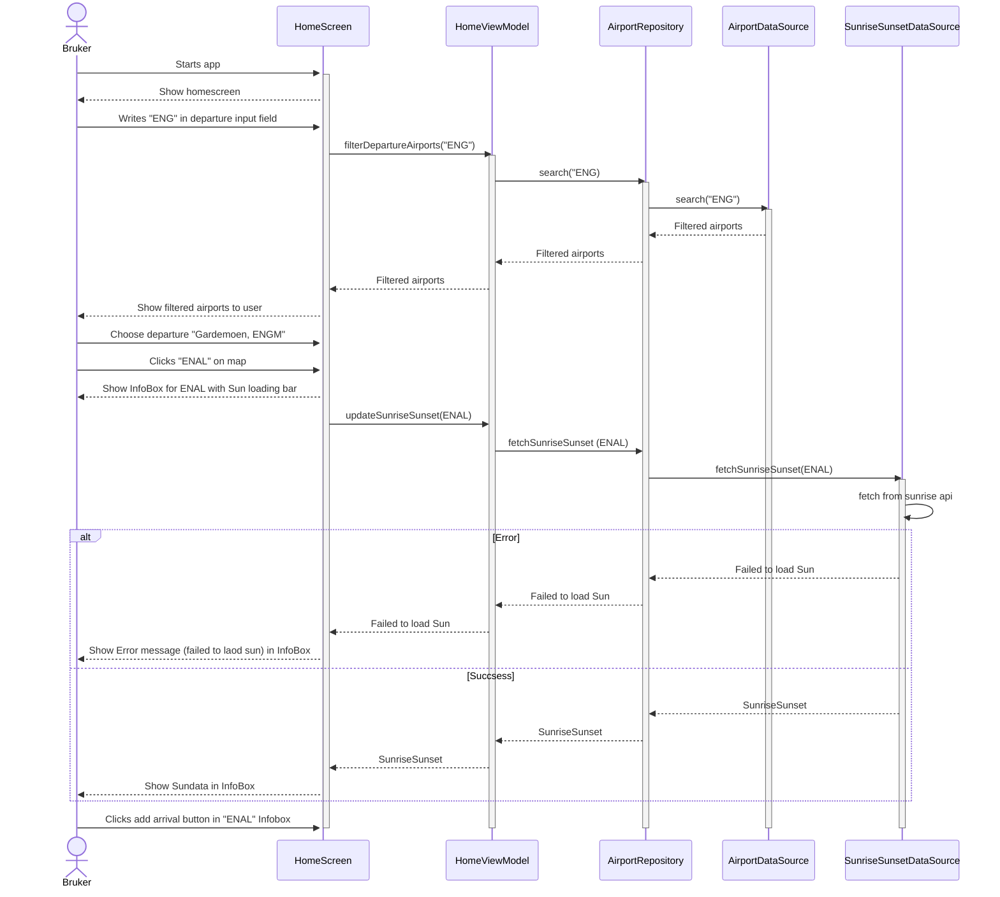

# Sekvensdiagram: Valg av departure/arrival



**Tekstlig beskrivelse**\
**Navn:** Valg av departure og arrival airport\
**Aktør:** Småflypilot\
**Prebetingelser:** Ingen prebetingelser\
**Postbetingelser:** Departure og arrival flyplass er valgt. Appen er klar til å opprette\
flightbrief

## Hovedflyt:
1. User starts app
2. Appen viser HomeScreen
3. Piloten skrive inn "ENG" i departure input feltet
4. filterDepartureAirports funksjon blir kalt med "ENG" argument
5. search("ENG") i airportRepository blir kalt
6. search funksjonen i AirportDataSource blir kalt og returnerer flyplasser filtrert på "ENG"
7. de filtrerte flyplassene returneres fra AirportRepository til HomeViewModel
8. searchResults i homeViewModel UiState oppdateres til de filtrerte flyplassene
9. De filtrerte flyplassene vises til bruker
10. Bruker velger "Oslo lufthavn, Gardemoen" som departure flyplass
11. Bruker trykker på "ENAL" i kartet
12. HomeScreen viser InfoBox Composable for Ålesund flyplass, ENAL. Med loading bar for soldata
13. HomeScreen kaller på updateSunriseSunset(ENAL) i AirportRepository
14. updateSunriseSunset kaller videre på fetchSunriseSunset i SunriseSunsetDataSource
15. fetchSunriseSunset henter data fra Sunrise api`et til MET og returnerer en SunriseSunset instans
16. SunriseSunset returneres til AirportRepository
17. AirportRepository returnerer SunriseSunset for ENAL til HomeViewModel
18. HomeViewModel oppdaterer sun i UiState
19. HomeScreen viser soldata for Ålesund, ENAL
20. Bruker trykker på add arrival knappen i InfoBoxen

## Alternativ flyt:
15.1. fetchSunriseSunet klarer ikke å hente data fra api, returnerer error melding til airportRepository\
15.2. Feilmelding blir returnert til HomeViewModel. state sin sun blir satt til Error\
15.3. Feilmelding vises til bruker i InfoBox\


# Aktivitetsdiagram metar/taf

```mermaid
flowchart TD;
    style start fill: #000, stroke: #fff, stroke-width: 2px;
    style B fill: #228B22;
    style C fill: #177578;
    style D fill: #177578;
    style E fill: #228B22;
    style F fill: #177578;
    style G fill: #ff7f0e;
    style H fill: #228B22;
    style I fill: #228B22;
    style J fill: #177578;
    style K fill: #228B22, stroke: #228B22, stroke-width: 2px;
    style stop fill: #000, stroke: #fff, stroke-width: 2px;
    start((Start))
    start --> B(Homescreen)
    B --> C[/User chooses Departure/]
    C --> D[/User presses Go to brief/]
    D --> E(Flightbriefscreen #departuretab)
    E --> F[/Open metar/taf collapsible/]
    F --> G{airport has metar/taf?}
    G -->|no| H(Show nearby airports with metar/taf)
    H --> J[/User selects new airport/]
    J --> K(Metar/taf for selected airport)
    G -->|yes| I(Show Metar/Taf)
    K --> stop((End))
    I --> stop 
 ```
