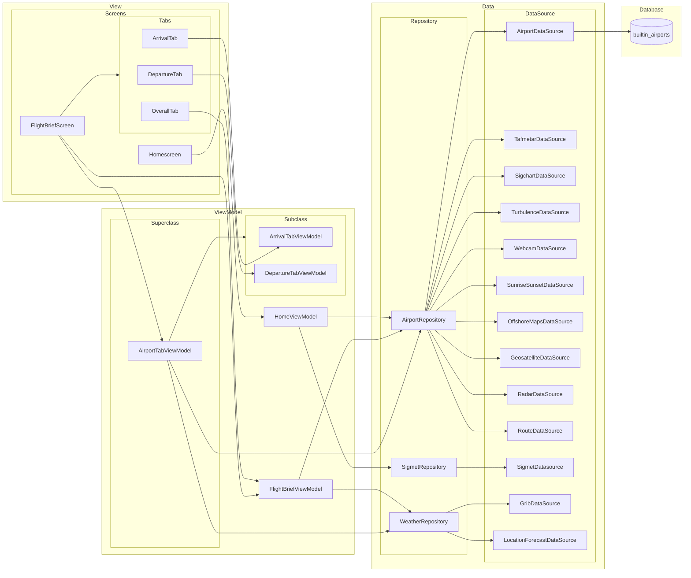

# Arkitektur

## MVVM

### Datalaget

#### Datasource

I datalaget har vi forskjellige datakilder (DataSource) som gir tilgang til ulike typer data som
trengs i appen. Dette inkluderer informasjon om flyplasser, værdata, SIGMETs, osv. Disse datakildene
blir tilgjengeliggjort gjennom respektive repositories.

#### Repository

Repository-laget fungerer som et mellomledd mellom datakildene og viewmodellene. Hvert repository
har ansvar for å hente data fra en eller flere datakilder og tilby dem til viewmodellene. For
eksempel, AirportRepository henter data fra forskjellige kilder som AirportDataSource,
TafmetarDataSource osv.

### ViewModel laget

ViewModel-laget er koblingen mellom forretningslogikken og brukergrensesnittet. Her har vi
forskjellige viewmodeller som er ansvarlige for å behandle data og forberede det for visning. For
eksempel, FlightBriefViewModel håndterer logikken for visning av flyinformasjon på forsiden, mens
AirportTabViewModel styrer visningen av flyplassinformasjon i fanen for flyplasser.

### View laget

View-laget består av brukergrensesnittet, representert av forskjellige skjermer og komponenter. For
eksempel, Homescreen og FlightBriefScreen viser de overordnede grensesnittene, mens fanene (Tabs)
inne i FlightBriefScreen viser detaljert informasjon om flyvninger knyttet til avreise flyplass,
eventuelt ankomstflyplass og også en mer generell tab med værinformasjon som ikke direkte er knyttet
til en spesifikk flyplass (lokasjon).

### Database

Vi har også en database som inneholder data om flyplasser, som er tilgjengelig for bruk via
AirportRepository (som henter fra AirportDataSource).

## Hvordan opprettholdes MVVM-mønsteret?

- **Separasjon av bekymringer:** MVVM sikrer en klar separasjon mellom forretningslogikk (ViewModel)
  og brukergrensesnitt (View). Dette gjør koden mer modulær, testbar og lettere å vedlikeholde.
- **Databinding:** ViewModel kommuniserer med View gjennom data binding. Dette gjør det enkelt å
  oppdatere grensesnittet når data endres i ViewModel, og vice versa, uten behov for direkte
  manipulasjon av visningene.
- **Enveis datastrøm:** Datastrømmen i MVVM går fra modellen til viewmodellen, og deretter til
  visningen. Dette sikrer at visningen ikke har direkte tilgang til modellen, noe som bidrar til å
  opprettholde separasjon av bekymringer og enklere testing.
- **Testbarhet:** Ved å separere forretningslogikk fra brukergrensesnittet blir det enklere å teste
  hver komponent uavhengig av hverandre. Dette øker påliteligheten til koden og gjør det enklere å
  identifisere og rette feil.

# Kobling og kohesjon

### Dependency Injection med Dagger Hilt i Prosjektet

I vårt prosjekt bruker vi Dagger Hilt for dependency injection. Dette tillater oss å opprettholde
lav kobling og høy kohesjon i koden vår, noe som bidrar til en mer robust og vedlikeholdbar
arkitektur.

#### Lav kobling

Dependency injection gjennom Dagger Hilt bidrar til lav kobling ved å fjerne direkte avhengigheter
mellom klassene i prosjektet. Istedenfor å ha klasser som instansierer og er direkte avhengige av
andre klasser, injiserer vi avhengigheter eksternt, noe som gjør klassene mer uavhengige og lettere
å teste og vedlikeholde.

**Eksempel:**
Viewmodels trenger ikke å vite noe om hvordan datasources blir laget. En viewmodel som trenger
tilgang til data fra en kilde, for eksempel en FlightBriefViewModel, trenger bare å injisere
relevante repositories eller datasources. Den trenger ikke å bekymre seg for hvordan disse klassene
blir opprettet eller konfigurert, da Dagger Hilt tar seg av dette.

#### Høy kohesjon

Ved å bruke Dagger Hilt opprettholder vi høy kohesjon i koden vår ved å organisere avhengigheter i
moduler basert på funksjonalitet. Dette gjør det enklere å forstå og vedlikeholde koden, da hver
modul inneholder relaterte avhengigheter.

**Eksempel:**
Hvis en viewmodel skulle lage en repository, måtte den også kjent til hvilke datasources repository
bruker. Men med Dagger/Hilt slipper man det. Viewmodels trenger kun å vite om repositories, mens
repositories kan bli konfigurert til å bruke relevante datasources gjennom dependency injection,
uten at viewmodels trenger å kjenne til detaljene.

# UDF

Helt overordnet har vi en struktur i appen hvor vi på øverste nivå har en composable som lytter på
en state fra en viewmodel. Denne composablen sender data fra staten videre ned som argumenter til
nye composables. Det betyr at composables lenger ned kun har tilgang til dataen de har fått, men med
ingen måte å redigere eller endre på dataen direkte.

**Hendelse (Event):** Når brukeren samhandler med grensesnittet, for eksempel ved å flytte en slider
eller trykke på en knapp, genereres en hendelse. For eksempel kan brukeren justere avstanden på en
slider i WindsAloftRoute og trykke på en knapp, som resulterer i at onFractionSelected-funksjonen
blir kalt.

**Oppdater tilstand (Update state):** onFractionSelected funksjonen sendes oppver til den øverste
composablen med (sliderPosition.nauticalMiles, time). Den øverste composablen kaller på funksjon til
viewmodel som oppdaterer staten basert på argumentene.

**Vis tilstand (Display state):** Etter staten er oppdatert blir den nye tilstanden deretter passert
nedover til komponentene som viser oppdatert data i grensesnittet.

Fordelen med dette er at hver del av datastrømmen kan behandles uavhengig av hverandre, noe som gjør
det enklere å legge til nye funksjoner eller endre eksisterende funksjonalitet uten å påvirke andre
deler av systemet. Dette er spesielt nyttig når det gjelder komponenter som den beskrevne slideren
nevnt ovenfor og andre komponenter som brukes hyppig i appen, for eksempel TimeRow Composables og
ImageComposables. Disse komponentene trenger ikke å vite noe om noen ViewModel. Det betyr at de kan
brukes helt separat, for eksempel i en Preview, uten å være avhengige av noen annen del av systemet.
Dette gjør det enkelt å teste og vedlikeholde komponentene uavhengig av resten av applikasjonen, og
gjør det enklere å introdusere endringer eller nye funksjoner uten å forstyrre eksisterende
funksjonalitet.

# Vedlikehold

# Videreutvikling

# API nivå

Vi har valgt å bruke API nivå 33. Grunnen til dette er fordi