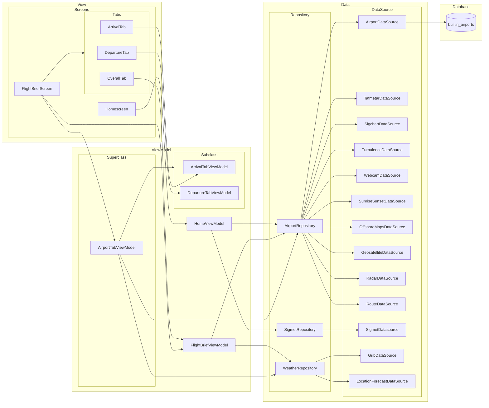

```mermaid
graph LR

    subgraph DataLayer[Data]
        subgraph DataSource
            AirportDataSource 
            TafmetarDataSource 
            SigchartDataSource 
            TurbulenceDataSource 
            WebcamDataSource
            SunriseSunsetDataSource 
            OffshoreMapsDataSource 
            GeosatelliteDataSource
            RadarDataSource 
            RouteDataSource 
            SigmetDatasource 
            GribDataSource
            LocationForecastDataSource
        end
        subgraph Repository
            AirportRepository
            SigmetRepository 
            WeatherRepository 
            WeatherRepository 
        end
    end

    subgraph ViewModelLayer[ViewModel]
        FlightBriefViewModel
        HomeViewModel
        subgraph Superclass
            AirportTabViewModel
        end
        subgraph Subclass
            ArrivalTabViewModel
            DepartureTabViewModel
        end
    end

     subgraph ViewLayer[View]
        subgraph Screens
            Homescreen
            FlightBriefScreen
            subgraph Tabs
                DepartureTab
                ArrivalTab
                OverallTab
            end
        end
    end
    subgraph Database
        base[(builtin_airports)]
    end
   
    Homescreen --> HomeViewModel
    FlightBriefScreen --> FlightBriefViewModel
    FlightBriefScreen --> AirportTabViewModel
    FlightBriefScreen --> Tabs

    OverallTab --> FlightBriefViewModel
    DepartureTab --> DepartureTabViewModel
    ArrivalTab --> ArrivalTabViewModel
    

    AirportTabViewModel --> AirportRepository
    AirportTabViewModel --> WeatherRepository
    AirportTabViewModel --> Subclass

    FlightBriefViewModel --> AirportRepository
    FlightBriefViewModel --> WeatherRepository

    HomeViewModel --> AirportRepository
    HomeViewModel --> SigmetRepository
    

    AirportRepository --> AirportDataSource --> base[(builtin_airports)]
    AirportRepository --> TafmetarDataSource
    AirportRepository --> SigchartDataSource
    AirportRepository --> TurbulenceDataSource
    AirportRepository --> WebcamDataSource
    AirportRepository --> SunriseSunsetDataSource
    AirportRepository --> OffshoreMapsDataSource
    AirportRepository --> GeosatelliteDataSource
    AirportRepository --> RadarDataSource
    AirportRepository --> RouteDataSource
    SigmetRepository --> SigmetDatasource
    WeatherRepository --> GribDataSource
    WeatherRepository --> LocationForecastDataSource
```
