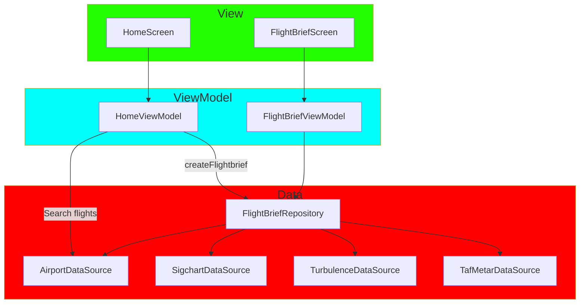

```mermaid
graph TD
    viewHome[HomeScreen]
    viewFlight[FlightBriefScreen]
    viewModelHome[HomeViewModel]
    viewModelFlight[FlightBriefViewModel]
    flightRepo[FlightBriefRepository]
    dataAirport[AirportDataSource]
    dataSigchart[SigchartDataSource]
    dataTurbulence[TurbulenceDataSource]
    dataMetarTaf[TafMetarDataSource]

    subgraph view[View]
        viewHome
        viewFlight
    end

    subgraph viewmodel[ViewModel]
        viewModelHome
        viewModelFlight
    end

    subgraph data[Data]
        flightRepo
        dataAirport
        dataSigchart
        dataTurbulence
        dataMetarTaf
    end

    viewHome --> viewModelHome
    viewFlight --> viewModelFlight
    viewModelHome -->|Search flights| dataAirport
    viewModelHome -->|createFlightbrief| flightRepo
    viewModelFlight --> flightRepo
    flightRepo --> dataAirport
    flightRepo --> dataSigchart
    flightRepo --> dataTurbulence
    flightRepo --> dataMetarTaf
    classDef viewColor fill: #23FF00
    classDef viewModelColor fill: #00FFFB
    classDef dataColor fill: #FF0000
    classDef title font-size: 22px
    classDef paddingData padding-right: 2em;
    class view title
    class viewmodel title
    class data title
    class data paddingData
    class view viewColor
    class viewmodel viewModelColor
    class data dataColor
```
