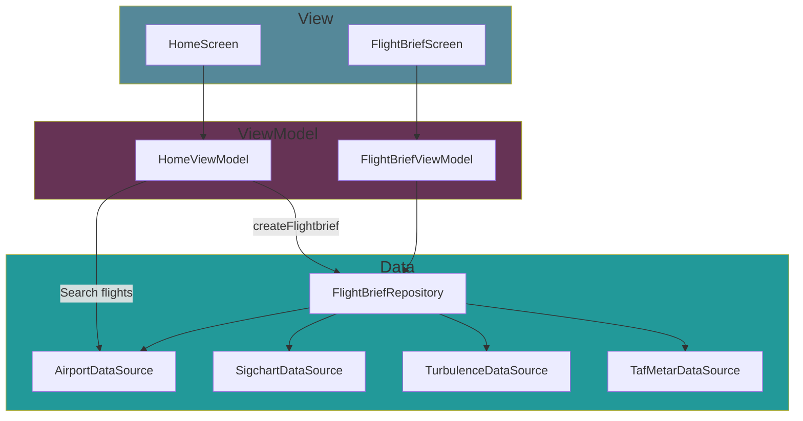

```mermaid
graph TD

viewHome[HomeScreen]
viewFlight[FlightBriefScreen]

viewModelHome[HomeViewModel]
viewModelFlight[FlightBriefViewModel]

flightRepo[FlightBriefRepository]
dataAirport[AirportDataSource]
dataSigchart[SigchartDataSource]
dataTurbulence[TurbulenceDataSource]
dataMetarTaf[TafMetarDataSource]


subgraph view[View]
viewHome
viewFlight
end


subgraph viewmodel[ViewModel]
viewModelHome
viewModelFlight
end


subgraph data[Data]
flightRepo
dataAirport
dataSigchart
dataTurbulence
dataMetarTaf
end


viewHome --> viewModelHome
viewFlight --> viewModelFlight

viewModelHome --> |Search flights| dataAirport
viewModelHome --> |createFlightbrief| flightRepo

viewModelFlight --> flightRepo

flightRepo --> dataAirport
flightRepo --> dataSigchart
flightRepo --> dataTurbulence
flightRepo --> dataMetarTaf

classDef viewColor fill:#589
classDef viewModelColor fill:#635
classDef dataColor fill:#299
classDef title font-size: 22px
classDef paddingData padding-right: 2em;


class view title
class viewmodel title
class data title

class data paddingData

class view viewColor
class viewmodel viewModelColor
class data dataColor
```
